# Open Financial Terminal — Windows

A native Windows build of **Open Financial Terminal**: a Bloomberg-style, dockable-widget financial
workspace — live charts, an options desk, a factor screener, backtesting, portfolio & risk, paper
trading, SEC filings, macro/rates, and a fleet of LLM research agents — running as a real Windows
desktop app, **no browser and no login**.

<p align="center">
  
</p>

<p align="center">
  
  
  
  
  <a href="https://github.com/Yimunan/open-financial-terminal-windows/releases/latest">
    </a>
</p>

---

## Contents

- [Install](#-install)
- [The workspace](#the-workspace)
- [Modules](#modules) — a screenshot + description of all **34** widgets
- [Data & configuration](#data--configuration)
- [Build from source](#build-from-source)
- [Why this repo is standalone](#why-this-repo-is-standalone)
- [Notes & caveats](#notes)
- [Credits & license](#credits--license)

---

## ⬇️ Install

1. Download **`OpenFinancialTerminal-Setup.exe`** from the
   [latest release](https://github.com/Yimunan/open-financial-terminal-windows/releases/latest).
   If Edge flags the download, choose **… → Keep → Keep anyway**.
2. Run it. Because the installer is **not code-signed**, SmartScreen shows
   **"Windows protected your PC"** — click **More info → Run anyway** (once).
3. Pick an install mode:
   - **All users** (UAC prompt) → `C:\Program Files\Open Financial Terminal`
   - **Just me** (no admin) → `%LOCALAPPDATA%\Programs\Open Financial Terminal` — also available
     silently via `OpenFinancialTerminal-Setup.exe /CURRENTUSER`
4. Launch **Open Financial Terminal** from the Start menu.

> First launch takes a little longer (the app seeds its data directory and Windows Defender scans the
> bundle once), then it's fast. A one-time background bootstrap downloads a baseline market-data lake
> (Dow 30 + crypto majors, 3 years) — charts fill in as data lands.
> Full details in [INSTALL-Windows.md](INSTALL-Windows.md).

**Requirements:** Windows 10 or 11, **64-bit (x64)**, and the **Microsoft Edge WebView2 Runtime** —
preinstalled on Windows 11 and most updated Windows 10 machines. If the app starts but no window
appears, install the
[Evergreen WebView2 Runtime](https://developer.microsoft.com/microsoft-edge/webview2/) and relaunch.

---

## The workspace

The terminal is a single window tiled with **draggable, resizable, tabbed widgets** — a Dockview
"bento" grid you rearrange freely, split into panes, tab together, maximize, or pop out into their
own native window (⧉).

A few conventions run through every module:

- **Ctrl+K command bar** — open any module, jump to a symbol, or apply a workspace template.
- **Link channels** — each widget carries a colored dot (🔴 red / 🔵 blue / 🟢 green, or none). Widgets
  on the same channel **share the active symbol**, so picking `NVDA` in a Watchlist retargets the
  linked Chart, Quote, Order Book, News and Options in one click. Different channels track different
  symbols side-by-side.
- **Freshness badges** — every value is tagged **LIVE / DELAYED / EOD** so you always know how fresh
  a number is.
- **Workspace templates** — ready-made desks (Equities Day-Trading, Crypto, Research & Due Diligence,
  Quant Research, Portfolio & Risk, Macro & Markets, Algo/Execution) you can apply and then save your
  own layouts.
- **Cross-module "Send to…"** — hand a result off between modules (a screen → a watchlist, a backtest
  → paper trading, a factor → the backtester).

---

## Modules

All 34 modules at a glance — jump to any section below.

| Market & charts | Options | News & filings | Quant & backtesting | Portfolio & risk | Execution | Macro / FICC | Research & AI |
|---|---|---|---|---|---|---|---|
| [Watchlist](#watchlist) · [Market Board](#market-board) · [Quote](#quote) · [Profile](#profile) · [Chart](#chart) · [Chart Studio](#chart-studio) · [Order Book](#order-book) · [Time & Sales](#time--sales) | [Option Chain](#option-chain) · [Options Surface](#options-surface) | [News](#news) · [Topic News](#topic-news) · [Public Filings](#public-filings) · [New Listings](#new-listings) | [Screener](#screener) · [Factors](#factors) · [Factor Performance](#factor-performance) · [Backtest](#backtest) · [Strategies](#strategies) · [Models](#models) · [Sandbox](#sandbox) | [Portfolio](#portfolio) · [Portfolio Builder](#portfolio-builder) · [Risk Attribution](#risk-attribution) | [Paper Trading](#paper-trading) · [Algo Trading](#algo-trading) · [Market Making](#market-making) | [Macro](#macro) · [FICC](#ficc) | [Assistant](#assistant) · [Agent Workflow](#agent-workflow) · [Research Loop](#research-loop) · [Committees](#committees) · [Map](#map) |

> Screenshots below are captured from the running app with live data — real EDGAR filings, FRED
> macro series, market bars, a sample holdings book and paper positions, a full Barra risk
> decomposition, and an LLM-built chart. (They were captured on the macOS build of the same code —
> the UI is identical across platforms.) One exception renders its **empty state**: Time & Sales
> (the equity tape needs a live feed — add Alpaca keys).

### Market data & charts

#### Watchlist
A live, linkable list of symbols with a 30-day sparkline, last price and % change. Equities poll
delayed/EOD quotes; crypto rows ride the live ticker stream; an optional NBBO bid/ask sub-line sits
under the price. Add tickers inline and link the list to a channel to drive the rest of your desk.


#### Market Board
A cross-asset quote board with tabs for **Equities, Commodities, Bonds & Rates, FX and Crypto**, plus
a cross-asset **Correlation** view — indices and benchmarks with sparklines and change at a glance.

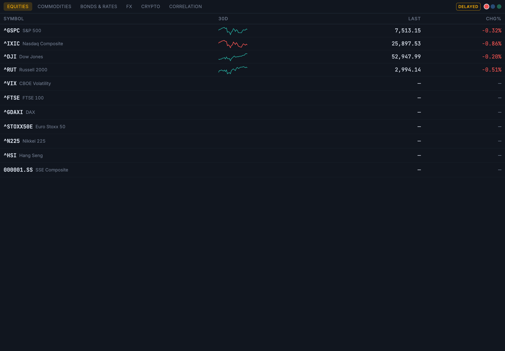

#### Quote
A focused single-symbol quote: large last price and change, sparkline, bid/ask, spread, day high/low
and volume, with a freshness badge. Enter Alpaca keys for live NBBO bid/ask.


#### Profile
Everything about one name on three tabs — **Metrics / Chart / Fundamentals**: valuation (market cap,
P/E, P/B), profitability & quality (ROE, margins), growth, risk/return (volatility, Sharpe, Sortino,
max drawdown, Calmar, beta), trailing returns and the 52-week range.


#### Chart
A price chart with **candles / Heikin-Ashi / area**, indicator overlays (SMA, EMA, RSI, MACD,
Bollinger) and 1m→1d timeframes, drawn on a from-scratch canvas engine with a volume histogram below.

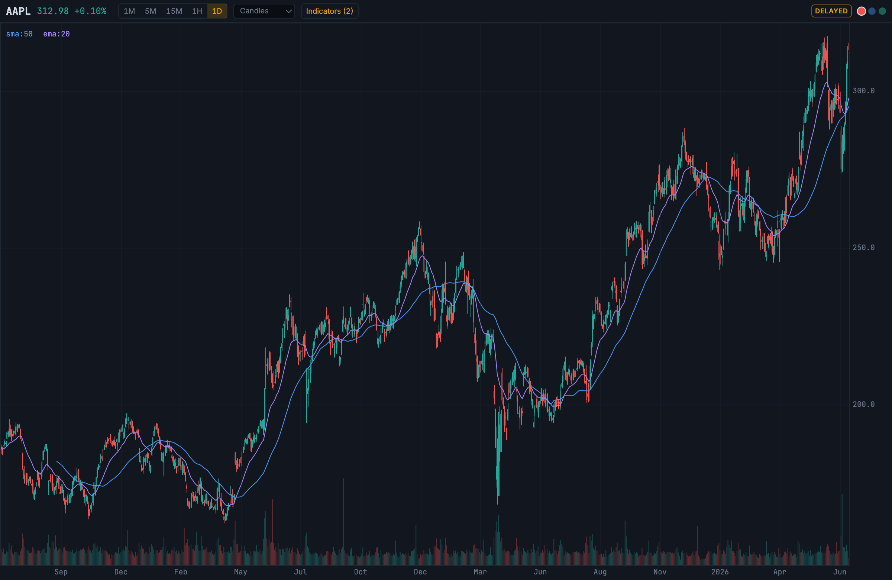

#### Chart Studio
A **chat-driven charting canvas**: describe the chart you want in plain English — *"AAPL daily with a
50-day SMA and RSI"*, *"compare AAPL, MSFT, NVDA over 1 year"* — and it builds it, keeping a history of
past charts.

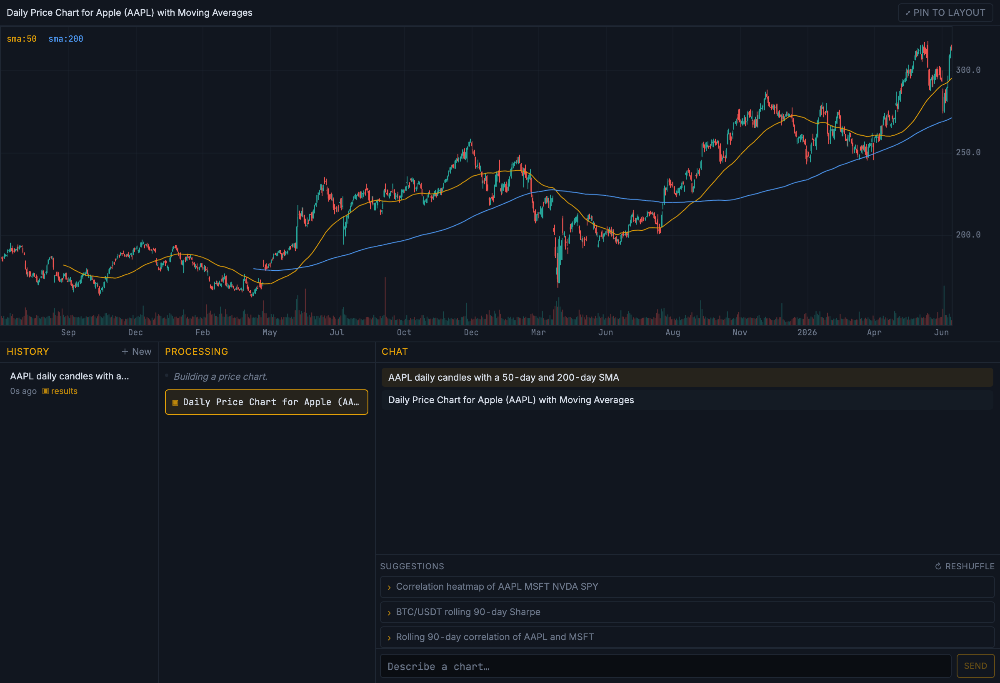

#### Order Book
A live **L2 depth ladder** for any asset class, drawn as a depth heatmap (row width = cumulative size,
opacity ∝ level size; liquidity walls highlighted). Ships with a synthetic **sim** depth source and is
pluggable to real venues (IBKR / Databento / dxFeed).

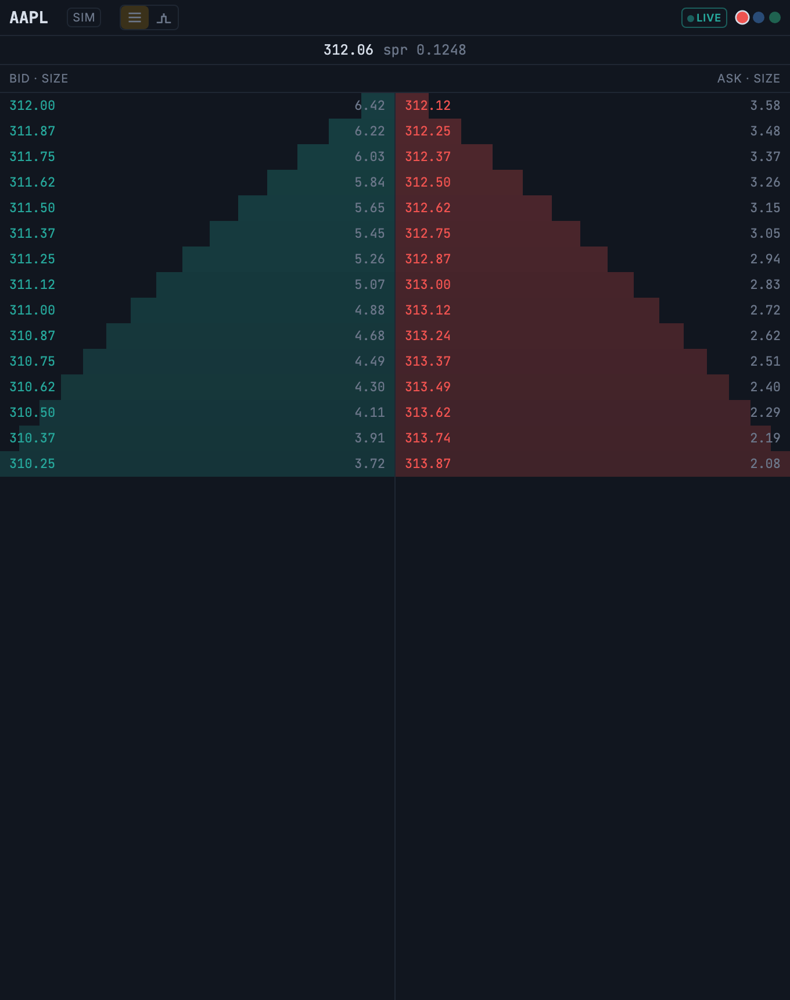

#### Time & Sales
The live **tape** — streaming trade prints (price, size, aggressor side) for any asset class. Equities
stream from a real feed (Alpaca); rates/FX/commodities use a built-in simulated tape.

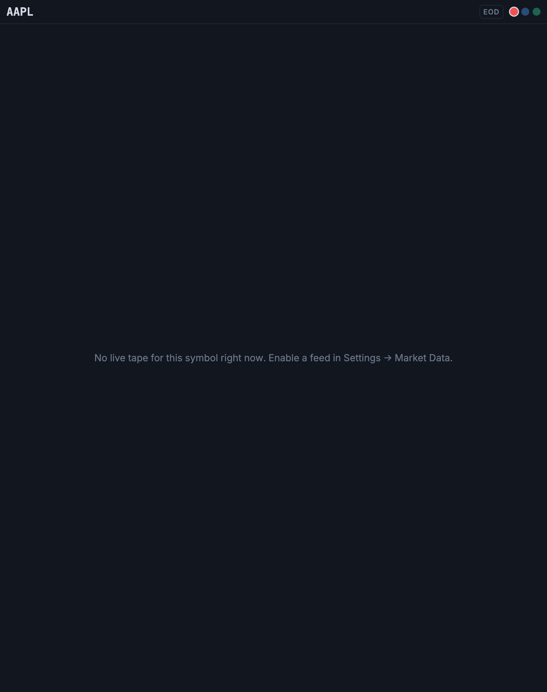

### Options

#### Option Chain
A full equity **options chain** (calls | strike | puts) with bid/ask, implied vol and greeks per
expiry. Select contracts to build a single-leg ticket and paper-trade it.

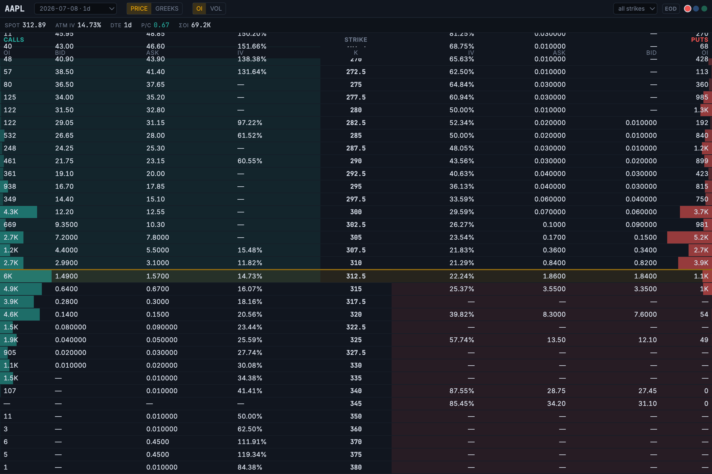

#### Options Surface
The implied-volatility structure for an underlying: the per-expiry **IV smile** (calls vs puts across
strikes) and an expiry×strike **IV surface heatmap**.


### News & filings

#### News
Per-symbol headlines for the linked ticker, each **LLM-scored for sentiment** and composite-ranked,
aggregated across sources with timestamps.


#### Topic News
Symbol-agnostic **topic feeds** — built-in Market/Macro streams or your own interest topics — ranked
and searchable, each topic its own draggable tab.

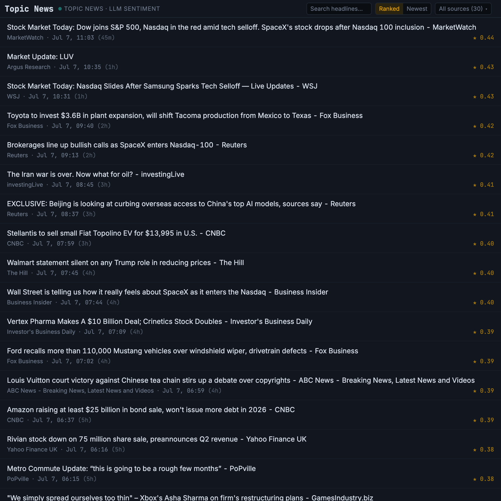

#### Public Filings
**SEC/EDGAR** filings for a company (Financials, Events, Insider, Ownership, Governance, Offerings)
with quick access to the source documents, plus Insider and Institutional views.

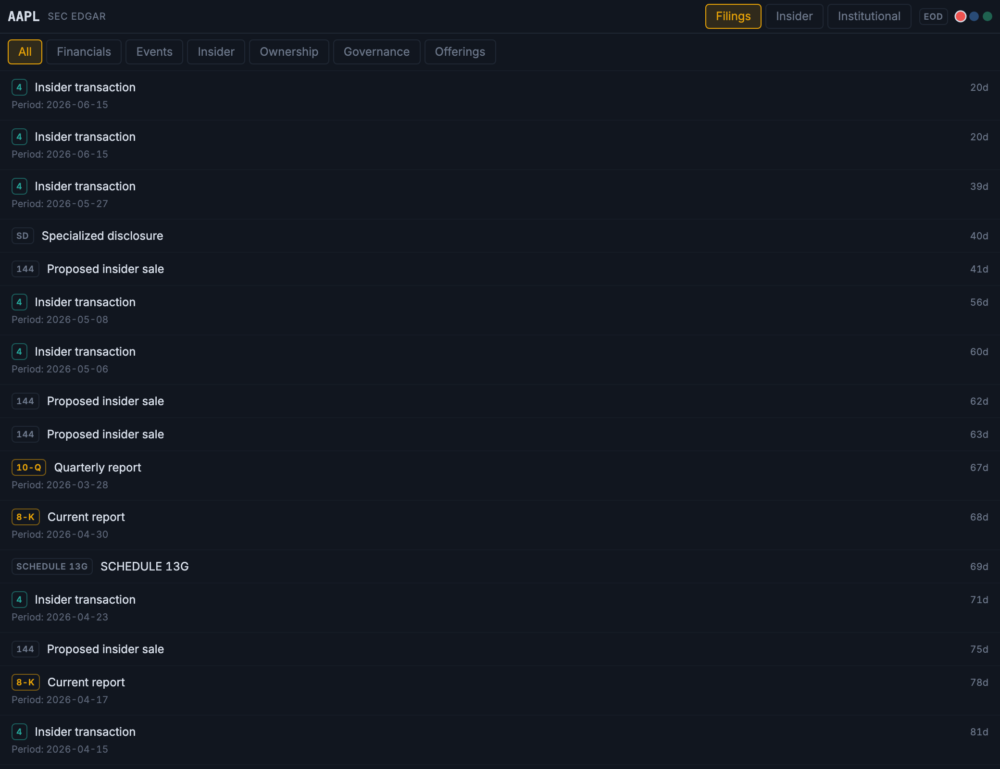

#### New Listings
Recent **exchange listings and IPOs** (8-A12B family / 424B4) over a chosen lookback, filterable by
form type.


### Screening, factors & backtesting

#### Screener
A factor and **natural-language screener**: pick a universe + factor and Run, or ask in plain English
— *"defensive low-vol names in the Dow"* — and a local LLM maps your words onto the qhfi factor
catalog.

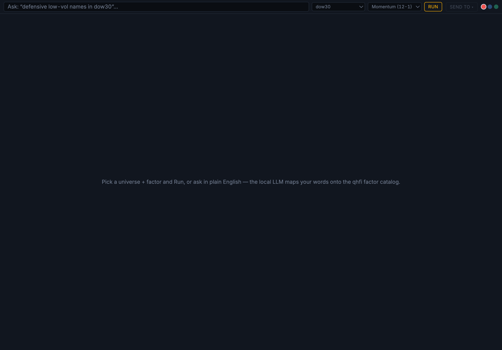

#### Factors
The **factor library** — built-in factors (momentum, volatility, reversal, value E/P & B/P, quality
ROE & gross-margin, the Alpha101 set, composites) plus the qhfi engine factors — to browse, summarize,
or open in the Sandbox.


#### Factor Performance
An agent-driven single-factor **drill-down across three diagnostic layers** (Returns / Risk / Health):
rank factors, inspect IC, quantile spreads, decay and turnover, and save a monitor.


#### Backtest
A cross-sectional **factor backtester**, a single-instrument **Lab** with parameter sweeps, and a
**Market-Making** mode — with transaction costs, PSR / Deflated Sharpe and an equity curve. Chat-driven
with ready-made idea templates.

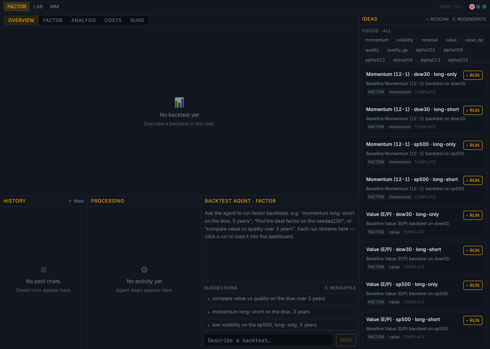

#### Strategies
A library of strategies: built-in single-symbol Lab templates (SMA/EMA/RSI/MACD crossover, Bollinger,
Donchian) and qhfi engine portfolio strategies (MDP, model, momentum). Test one on the linked symbol
or backtest it over a universe.


#### Models
The **model repository**: register and manage trained models that bundle a factor + strategy +
universe + params for reuse across research and execution.

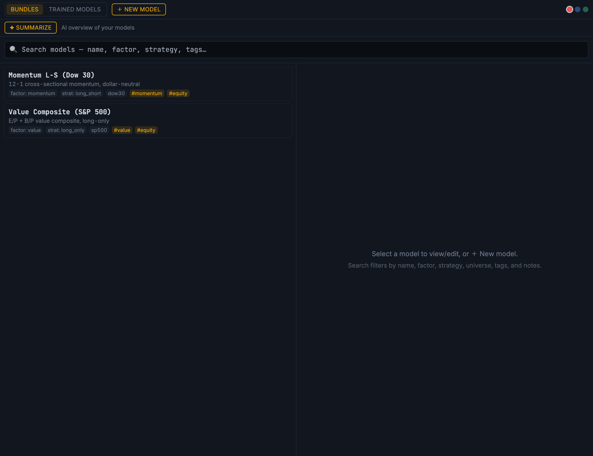

#### Sandbox
An **AST-restricted Python sandbox** for authoring custom factors/strategies: write a factor formula,
run it across a universe, and save it to your libraries — no imports, no I/O.

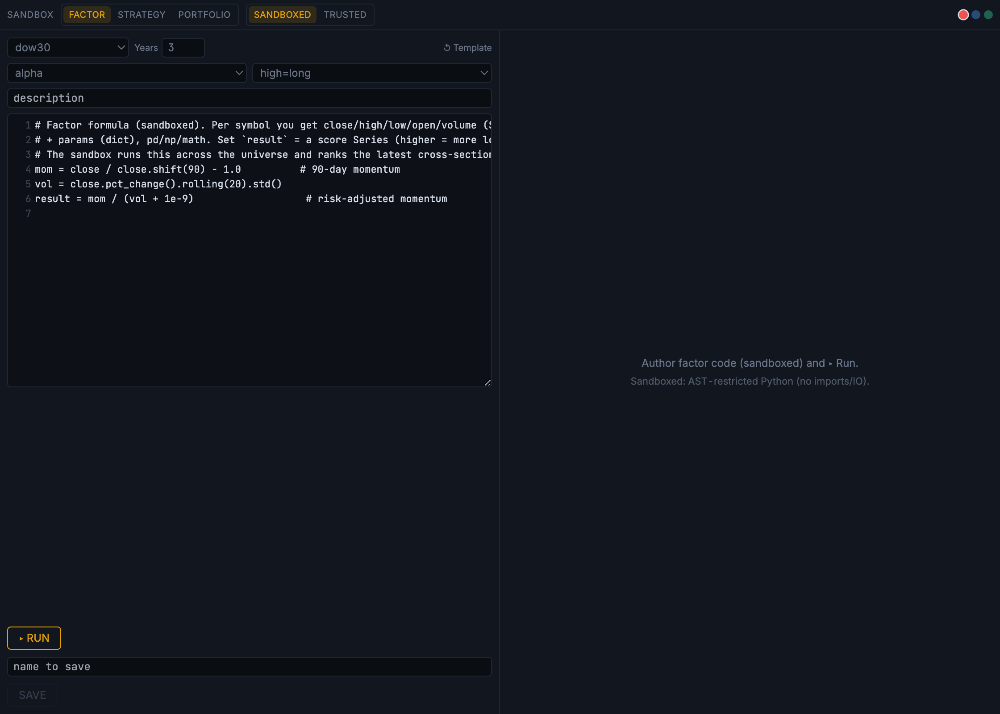

### Portfolio & risk

#### Portfolio
A holdings book with tabs for **Holdings, Composition, Risk and Attribution**: positions, cost, P&L,
and per-name composition.

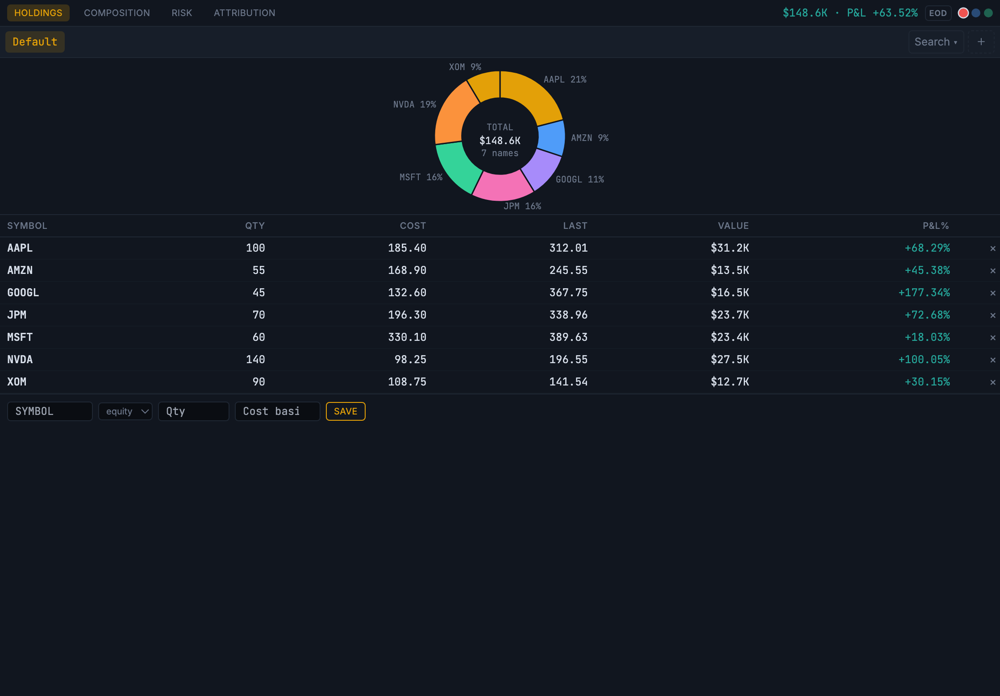

#### Portfolio Builder
Construct and save a portfolio as a **weight + allocation list** (symbol → target weight) that you can
normalize (gross 100%, dollar-neutral for long/short) and value into share counts against a capital
base.

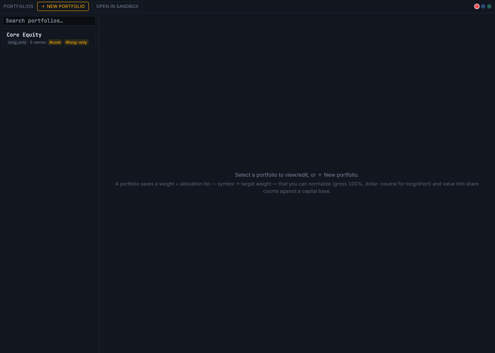

#### Risk Attribution
Portfolio-level **Barra factor + position risk decomposition** for the whole book, with Risk /
Realized / Brinson views and a Holdings/Paper source toggle.

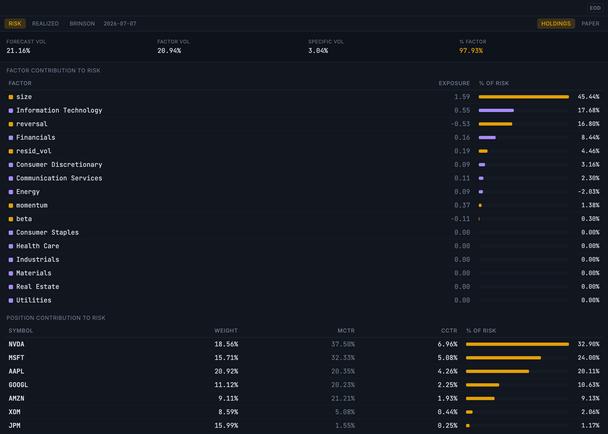

### Execution

#### Paper Trading
A paper-trading **blotter** (local simulator or **Alpaca paper**): order ticket, cash, unrealized /
realized P&L, positions, and an equity-curve sparkline.

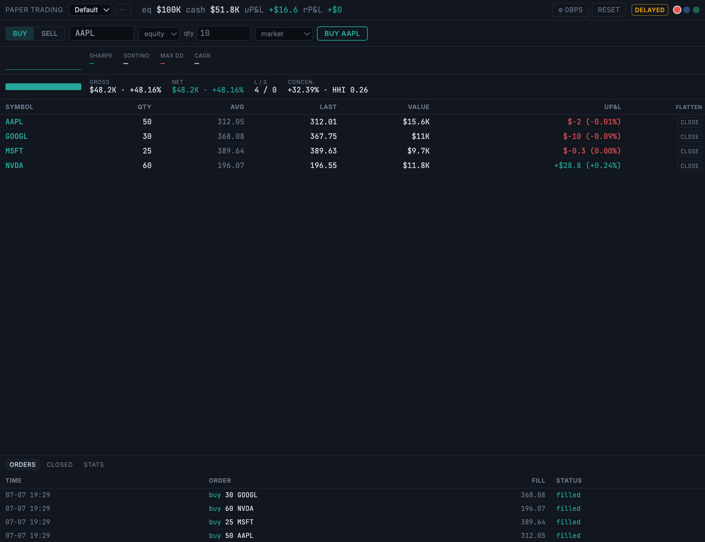

#### Algo Trading
Scheduled/templated **algos** seeded from the linked symbol (e.g. an AAPL SMA-cross, a Dow30 momentum
long-only), each arm-able and runnable on a cadence for automated paper execution.


#### Market Making
Compare **market-making quoting strategies** over real bars + synthetic depth, tuning book spread,
quote half-spread and inventory skew / limits.

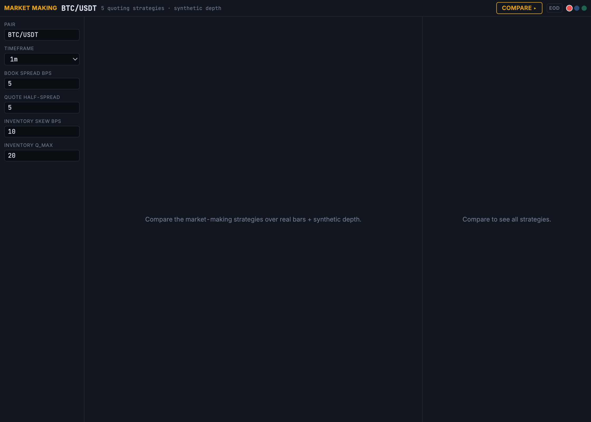

### Macro & FICC

#### Macro
A macroeconomic dashboard over the qhfi lake (**FRED + World Bank + Treasury curve**): a US indicators
grid, the Treasury yield curve, a series explorer over the full catalog, and a World Bank
cross-country panel.

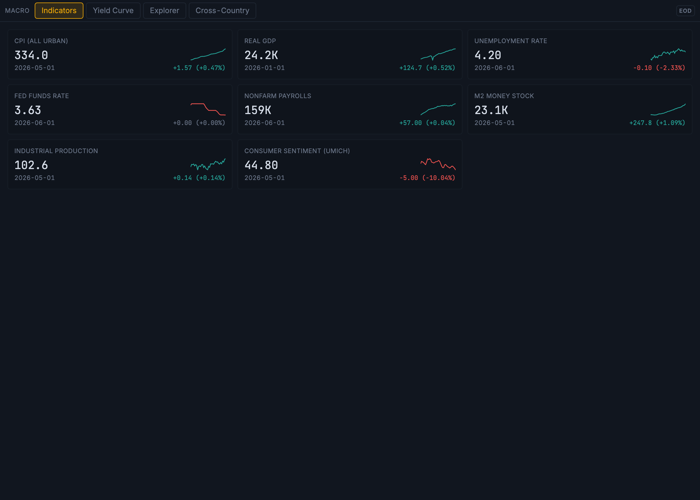

#### FICC
A unified **fixed-income / currencies / commodities** board: the Treasury yield curve and CME Treasury
futures complex (ZQ/ZT/ZF/ZN/ZB/UB), G10 spot FX, and the commodity futures complex
(metals/energy/agriculture), plus a cross-asset correlation tab. EOD daily bars.

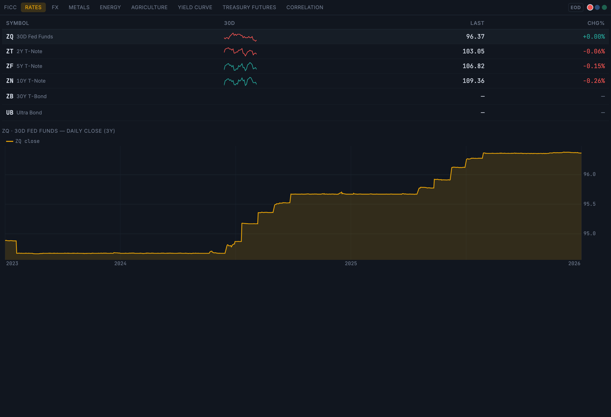

### Research & AI

#### Assistant
A streaming, **symbol-aware LLM assistant** grounded in the terminal's live data via read-only tools
(quote, fundamentals, news, compare, screen, performance). It can also **open and configure modules**
for you.


#### Agent Workflow
A **visual node-graph** you compile to a LangGraph agent: wire Data → Strategy → Portfolio →
Backtest/Execution nodes (and Quote, News, Factor-screen, Research Loop, Committee, LLM, Python steps).
With **Reveal** on, each node streams its output into the matching module.

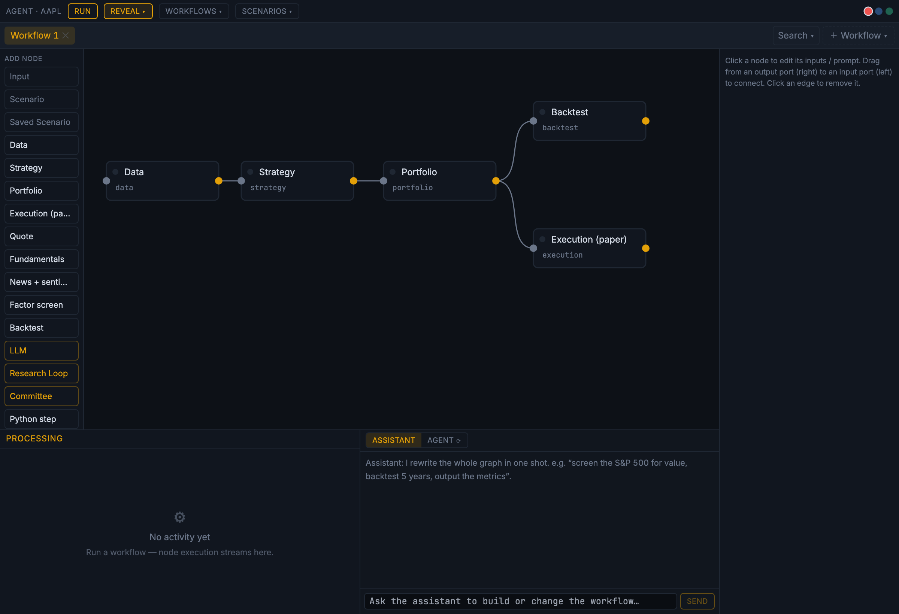

#### Research Loop
An autonomous **design → generate → evaluate → reflect** loop over the qhfi engine: give it a goal and
it designs a factor experiment, backtests it, grades it against the promotion scorecard, and iterates
up to 5 times — pinning the best.

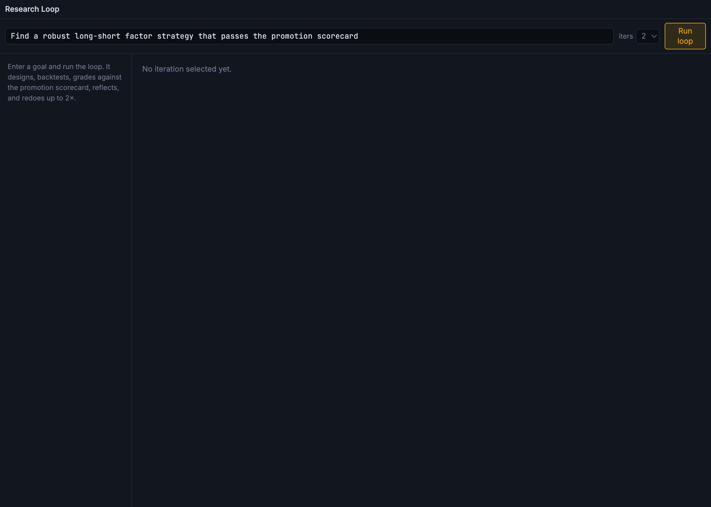

#### Committees
An **investment-committee simulation**: LLM agents (Bull/Growth, Bear/Risk, Macro Strategist, Chair)
whose assessments feed one another along a directed relationship graph toward a synthesized decision.
Runs on the external crew service or falls back to a local-LLM committee.


#### Map
An SVG **module-wiring map** of the terminal: **Catalog** mode shows the static architecture (every
widget type, channel groups, send routes and the data layer); **Live** mode shows your open workspace.
Filter by edge type (Links / Sends / Data).


---

## Data & configuration

- **Live public data out of the box** — equities via Yahoo Finance, crypto via ccxt (Kraken), SEC
  filings via EDGAR, Treasury curve via public rate series. No keys required for these.
- **Live equities & the tape (optional)** — add **Alpaca** paper keys under **Ctrl+K → Settings →
  Market Data** for live equity quotes, NBBO bid/ask, the streaming Time & Sales tape, and Alpaca
  paper trading. Order-book depth ships with a built-in simulator and is pluggable to IBKR /
  Databento / dxFeed.
- **AI assistant / NL screener / agents** — open **Ctrl+K → Settings → Model & provider** and point
  the terminal at any OpenAI-compatible API. Two equally supported flavors (the chip shows which one
  is active):
  - **Local API** — a server on your own machine, no key needed. Example (Ollama): base URL
    `http://localhost:11434/v1`, model `gemma4:e4b-it-qat` (or any model you've pulled).
  - **Online API** — a hosted provider, API key required. Example (DeepSeek): base URL
    `https://api.deepseek.com/v1`, model `deepseek-v4-flash`. **No key ships in the app.**
- App state (settings DB, qhfi config + registry, the market-data lake) lives under
  `%APPDATA%\OpenFinancialTerminal`; logs and the per-install encryption key live under
  `%LOCALAPPDATA%\OpenFinancialTerminal`. Each install generates its own encryption key on first run.

---

## Build from source

This repo is **standalone** — it vendors the complete application source (see
[why](#why-this-repo-is-standalone)), so one clone builds everything. The installer is a PyInstaller
freeze of the FastAPI backend + qhfi engine + the built SPA, wrapped by Inno Setup.

**On a Windows 10/11 x64 machine** (Python 3.11+, Node 18+, Inno Setup 6 —
`winget install JRSoftware.InnoSetup`):

```powershell
git clone https://github.com/Yimunan/open-financial-terminal-windows
cd open-financial-terminal-windows\open-financial-terminal
pwsh scripts\setup.ps1                              # venv + engine + backend + frontend deps
pwsh scripts\build_desktop.ps1 -Installer -Version 1.0.3
# → packaging\dist_installer\OpenFinancialTerminal-Setup-1.0.3.exe
```

**Or let CI do it**: the GitHub Actions workflow
[`.github/workflows/build-windows.yml`](.github/workflows/build-windows.yml) runs the exact same
pipeline on a `windows-latest` runner, smoke-tests the frozen backend (`--server-only` +
`/api/health`), and uploads the installer — it's how the release assets here are produced.

For day-to-day development (hot-reload backend + Vite dev server) see
[`open-financial-terminal/docs/DESKTOP.md`](open-financial-terminal/docs/DESKTOP.md).

---

## Why this repo is standalone

Unlike the [macOS distribution repo](https://github.com/Yimunan/open-financial-terminal-mac-os)
(docs + build tooling only), this repo **vendors pinned snapshots of both upstream projects** as
sibling directories — [`open-financial-terminal/`](open-financial-terminal/) (the terminal:
backend + frontend + Windows packaging) and
[`quant-hedge-fund-incubator/`](quant-hedge-fund-incubator/) (the qhfi quant engine, complete with
its `qhfi.data` / `qhfi.models` packages) — so a single clone builds with no external repos and no
version skew. The Windows-specific fixes (wiring `rthook_env.py` into the freeze, the versioned
installer) live only here and don't touch the upstream repos or the macOS build.

Snapshot provenance: `open-financial-terminal` @ branch `options-suite-pro-multileg` (`5885ce7`) and
`quant-hedge-fund-incubator` @ `main` (`3001d2c`), both including the in-flight working-tree changes
the macOS **v1.0.3** DMG was built from — the two platforms' v1.0.3 releases correspond to the same
source state. (Historical note: the public qhfi repo once shipped without `src/qhfi/data` and
`src/qhfi/models` due to unanchored `.gitignore` patterns; that's fixed upstream as of `ac1e752`,
and the copy vendored here is complete.)

---

## Notes

- **64-bit (x64) only** — no 32-bit or ARM64 Windows build.
- **Not code-signed** — expect the SmartScreen prompt on first run (see [Install](#-install)).
  Authenticode signing needs a paid certificate; the build script supports it (`-Sign`) when one is
  available.
- **WebView2 Runtime required** — preinstalled on Windows 11 and most updated Windows 10; otherwise
  install the [Evergreen runtime](https://developer.microsoft.com/microsoft-edge/webview2/).
- **Verification status** — each release is built and smoke-tested on GitHub Actions
  (`windows-latest`): the frozen backend boots and `/api/health` reports ok. The WebView2 app window
  and the interactive installer have not been hand-tested on physical Windows hardware; the identical
  UI is validated on the macOS build of the same code. If you hit a Windows-specific issue (blank
  window, WebView2, install), please [open an issue](https://github.com/Yimunan/open-financial-terminal-windows/issues).
- Macro (FRED) cards and EDGAR filings require reaching `fred.stlouisfed.org` / `www.sec.gov`; where
  those hosts are blocked they stay empty (the Treasury curve falls back to Yahoo tickers).

## Credits & license

Open Financial Terminal and the qhfi engine are **MIT-licensed** by their authors
([open-financial-terminal](https://github.com/Yimunan/open-financial-terminal),
[quant-hedge-fund-incubator](https://github.com/Yimunan/quant-hedge-fund-incubator)). This repo
vendors both and adds the Windows packaging + CI build tooling under the same license — see
[LICENSE](LICENSE).

*Not investment advice. Data is provided by third parties for informational use only.*
